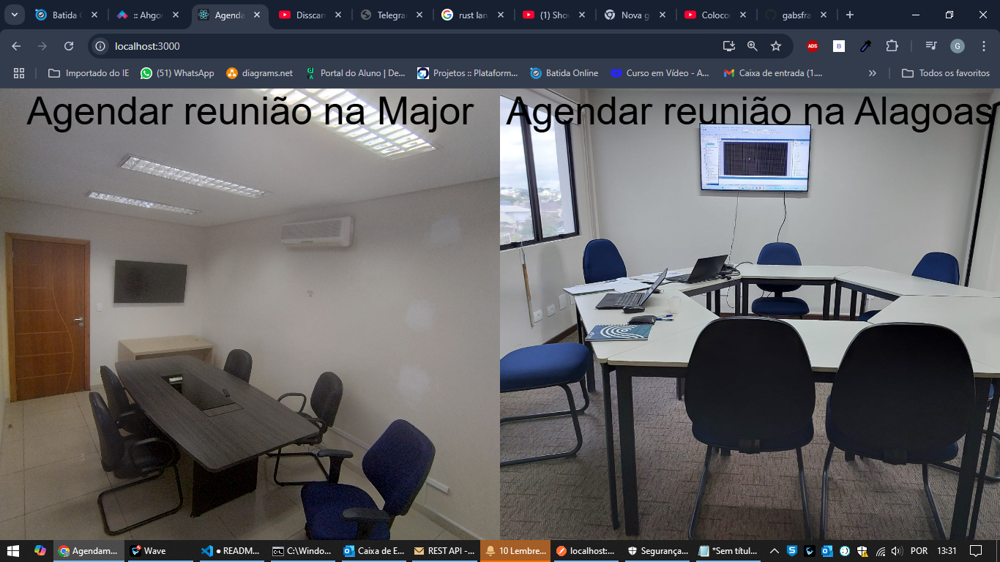
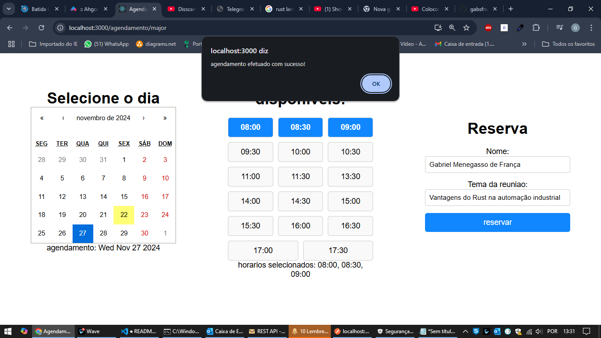
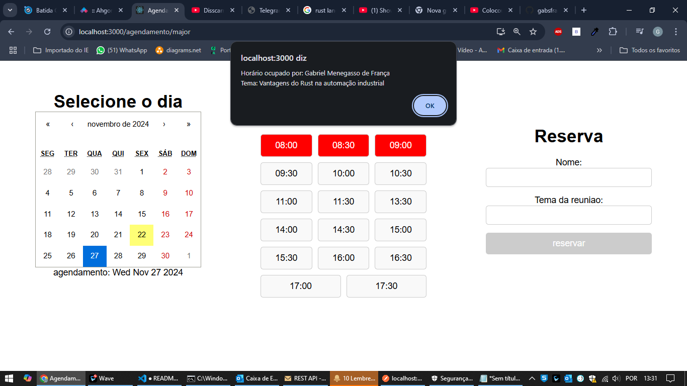

# agendar-salas
Projeto para uso interno na empresa. Onde o usuário poderá reservar a sala de reunião.

## Entrando no site você pode selecionar qual sala de reuniões você deseja reservar

## Depois você deve escolher dia, horário(s), inserir seu nome e o tema da reunião

## Depois de selecionados os horários, eles aparecerão em vermelho, e se clicados exibirão seus dados

